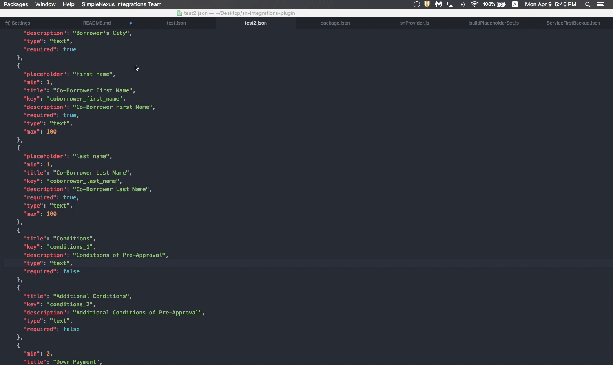
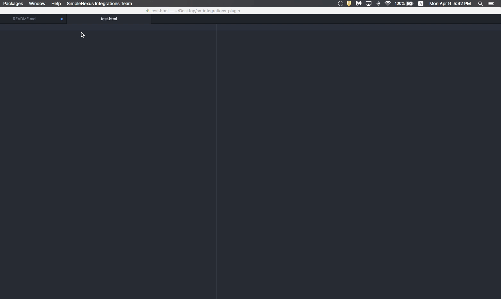

# sn-integrations-plugin
Atom plugin for SimpleNexus' Integrations team

## Features
### Autocomplete+ Integration

### JSON Beautifier

### Generate Boilerplate

### SICK touchbar integration!

## Installation
Clone the repo  
`git clone git@github.com:electr0sheep/sn-integrations-plugin.git`

Install using apm  
`cd sn-integrations-plugin`  
`apm link`
