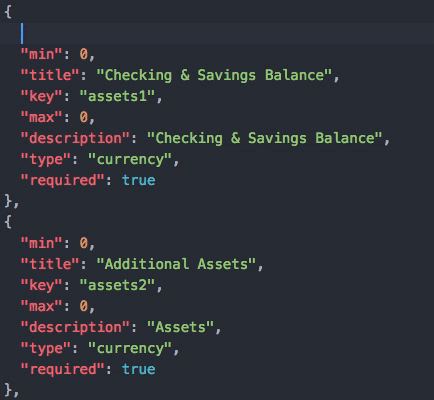
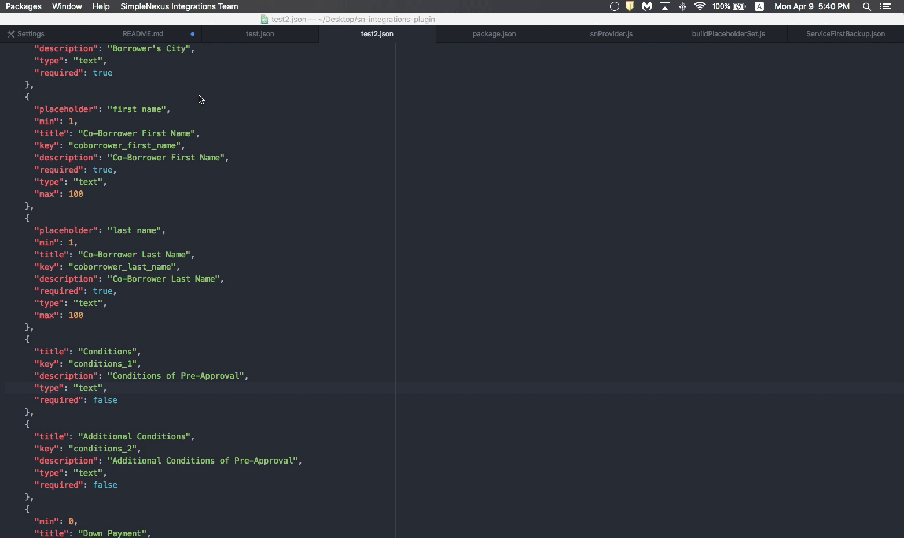

Test
# SimpleNexus-Integrations-Plugin
Atom plugin for SimpleNexus' Integrations team

## Features
### Autocomplete+ Integration

### JSON Beautifier

### Generate Boilerplate

### SICK touchbar integration!

## Installation
Clone the repo  
`git clone git@github.com:electr0sheep/SimpleNexus-Integrations-Plugin.git`

Install using apm  
`cd SimpleNexus-Integrations-Plugin`  
`apm link`

## Uninstallation
Uninstall using apm
`cd SimpleNexus-Integrations-Plugin`
`apm unlink`
